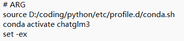
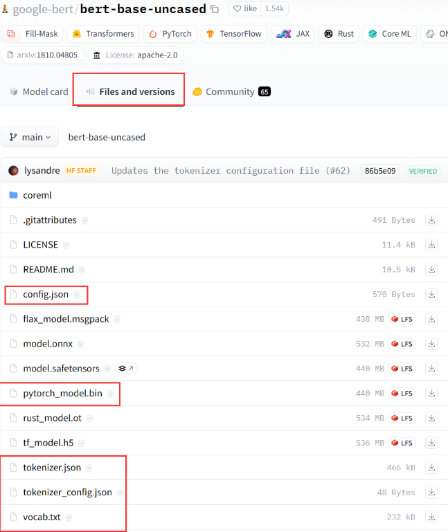
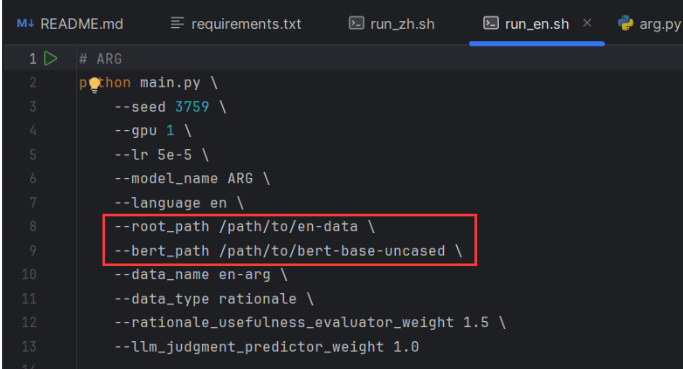
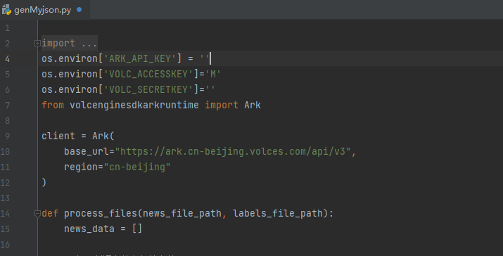
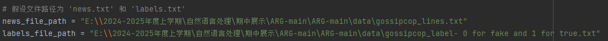

# ARG-复现食用指南 -深圳大学nlp实验
## 0. 环境配置
- 安装requirements.txt中的依赖包

- 随后将run_en中的source改成自己的conda.sh地址
conda activate （自己的虚拟环境名称）
## 1. 模型填充

-  到官网下载bert-base-uncased模型，将下载好的模型放到model文件夹下，并修改run_en_中的路径
-  若是想跑中文数据，需要下载对应的中文bert模型，并修改run_zh_中的路径

## 2. 数据集准备
- 若是想跑原论文的数据集，可以到
 https://forms.office.com/pages/responsepage.aspx?id=DQSIkWdsW0yxEjajBLZtrQAAAAAAAAAAAAO__QiMr41UNzZISUY3TkdNQk1WVTlVUDg2TFBaMzg4Si4u&route=shorturl
 该网址申请数据集，并放到data文件夹下

- 若是想跑自己的数据集，我编写了一个数据集处理脚本，可以参考使用我编写的genMyjson.py与genMydata.py文件，

- 首先使用genMyjson.py生成llm预处理的json文件，然后使用genMydata.py生成数据集，
注意这里需要自己修改相应的key，需要到官网上申请，豆包的模型32k，总体耗费在7元左右

我编写的脚本支持使用txt文本与标签文本，每行一一对应，经处理生成包含llm推理结果的json文件，若有其他不同格式文件，需要自行处理。

运行完genMyjson文件后，再运行genMydata文件，即可自动生成符合要求的数据集。

## 3. 模型训练与评估
- 直接运行run_en__或run_zh_中的train.py文件即可。
